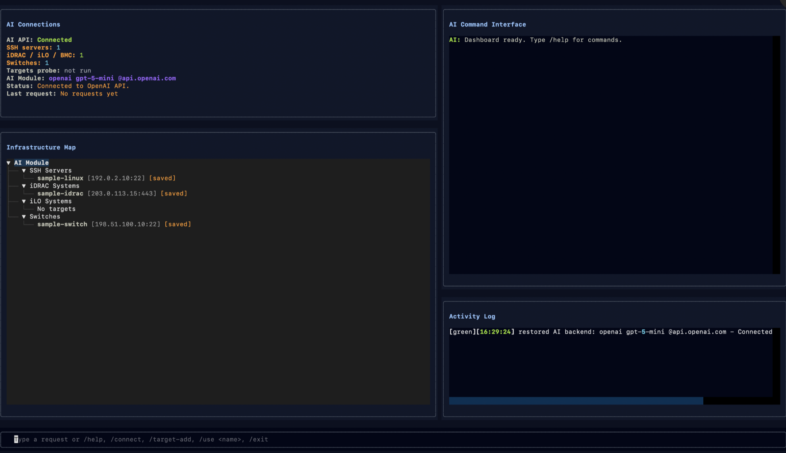

# MidMan

[](https://www.python.org/downloads/)
[](LICENSE)
[](https://github.com/x2vmbwtsjf-afk/MidMan/actions/workflows/ci.yml)

MidMan is a CLI-first assistant for infrastructure engineers that translates natural language troubleshooting requests into safe, approved diagnostics over SSH and related management interfaces.

It is built for operators who need help moving quickly across Linux hosts, switches, routers, and BMC-class endpoints, but do not want an automation tool issuing arbitrary remote commands. MidMan treats the CLI as the primary workflow, keeps execution bounded by an allowlist, and makes safety checks a first-class part of the request path.

MidMan is currently an early-stage project. The repository already includes a working CLI, profiles, playbooks, a command catalog, safety validation, mock mode, and tests. The parser, connector depth, and AI-assisted workflows are still evolving.



*Experimental Textual dashboard for interactive operator workflows.*

## What Problem MidMan Solves

Infrastructure troubleshooting often starts as a plain-language question and ends as a platform-specific series of commands spread across Linux, network devices, and management controllers. That process is repetitive, error-prone, and hard to standardize.

MidMan aims to provide a safer operator path:

- accept a troubleshooting request in plain language
- map it to a supported diagnostic action
- validate the action against a command allowlist
- run only approved, read-only checks
- keep the workflow in a local CLI that fits how infrastructure teams already operate

## Who It Is For

- SRE and platform teams operating Linux infrastructure
- network engineers diagnosing switches and routers
- operators working with iLO, iDRAC, and similar management endpoints
- incident responders who need fast, repeatable diagnostics
- teams that want AI assistance without unrestricted remote execution

## Why It Is Safer Than Normal SSH Automation

MidMan is intentionally narrower than a shell wrapper or generic AI agent:

- commands come from a reviewed catalog, not free-form remote text
- diagnostics are read-only by default
- destructive verbs and configuration-mode patterns are blocked
- profiles constrain target type and connection context
- playbooks package repeatable workflows into auditable YAML
- mock mode makes it possible to test flows without touching infrastructure

## Features

- CLI-first workflow built with Typer and Rich
- natural language request parsing for supported infrastructure intents
- explicit command catalog for Linux, network, and management checks
- safety engine with allowlist-only validation
- SSH execution for Linux and network targets
- management endpoint reachability checks for BMC-style targets
- YAML playbooks for repeatable diagnostics
- saved profiles for common targets
- mock mode for demos, development, and safe dry runs
- experimental Textual dashboard for repeated interactive use

## Architecture Overview

MidMan is organized as a small pipeline with clear control boundaries:

```text
Operator Request
      |
      v
CLI Layer
      |
      v
Parser / AI Layer
      |
      v
Safety Engine <----> Command Catalog
      |
      v
Execution Engine
      |
      v
SSH / Management Connectors
```

The parser may suggest an action, but it does not authorize it. Commands are resolved from the catalog, validated by the safety layer, and only then executed by the transport layer.

More detail is available in [ARCHITECTURE.md](ARCHITECTURE.md).

## Installation

MidMan currently targets Python 3.12.

```bash
python3.12 -m venv .venv
source .venv/bin/activate
python -m pip install -e ".[dev]"
```

## CLI Usage Examples

Inspect the CLI and local environment:

```bash
midman --help
midman doctor
midman catalog
```

Run a natural language diagnostic request:

```bash
midman ask "check cpu on server01" --profile sample-linux
```

Run a named action directly:

```bash
midman run linux_health --profile sample-linux
```

Run a playbook in mock mode:

```bash
midman run --playbook examples/playbooks/daily_checks.yaml --mock
```

Launch the interactive dashboard:

```bash
midman interactive --profile sample-linux --mock
```

## Profiles

Profiles define connection details and target metadata for saved infrastructure endpoints.

The current profile model supports:

- `name`
- `type` such as `linux`, `network`, or `management`
- `host`
- `port`
- `username`
- `auth`
- optional metadata and adapter hints

Example:

```yaml
name: sample-linux
type: linux
host: 192.0.2.10
port: 22
username: ops
auth:
  password_env: MIDMAN_SAMPLE_PASSWORD
```

MidMan looks for profiles in `profiles/` and `examples/profiles/`.

## Playbooks

Playbooks are YAML documents for repeatable diagnostic workflows. They are intended to encode approved operational checks instead of ad hoc remote command sequences.

Current playbooks support ordered `steps` and may also include richer metadata such as:

- `id`
- `title`
- `category`
- `intents`
- `command_group`
- `expected_signals`
- `follow_up_steps`
- `caution`

See [docs/PLAYBOOKS.md](docs/PLAYBOOKS.md) for the recommended schema.

## Safety Philosophy

MidMan is meant to diagnose infrastructure, not to administer it.

- Free-form shell execution is not supported.
- Approved actions must resolve to allowlisted commands.
- Read-only behavior is the default design assumption.
- Shell metacharacters and destructive terms are rejected early.
- Unsupported or ambiguous requests should fail rather than guess.

The current safety model is documented in [SECURITY.md](SECURITY.md).

## Example Troubleshooting Session

```text
$ midman ask "show interfaces on leaf01" --profile sample-switch --mock

Request accepted: show interfaces on leaf01
Resolved action: interface_status
Target: sample-switch (network)
Safety review: passed
Execution mode: mock

Approved commands:
  - show interfaces status
  - show ip interface brief

Result summary:
  - interface inventory returned
  - no write operations attempted
```

The important behavior is that MidMan resolves the request into a known action and then executes only the commands associated with that action.

## Developer Onboarding

```bash
python3.12 -m venv .venv
source .venv/bin/activate
python -m pip install -e ".[dev]"
python -m pytest
midman --help
```

Contributor guidance is in [CONTRIBUTING.md](CONTRIBUTING.md).

## Roadmap

The project roadmap is intentionally incremental:

- Phase 1: CLI MVP
- Phase 2: Playbooks
- Phase 3: AI parsing improvements
- Phase 4: Connectors for iLO, switches, routers, and related targets
- Phase 5: Interactive TUI hardening
- Phase 6: API and integrations

See [ROADMAP.md](ROADMAP.md) for the detailed plan.

## License

MidMan is released under the MIT License. See [LICENSE](LICENSE).
